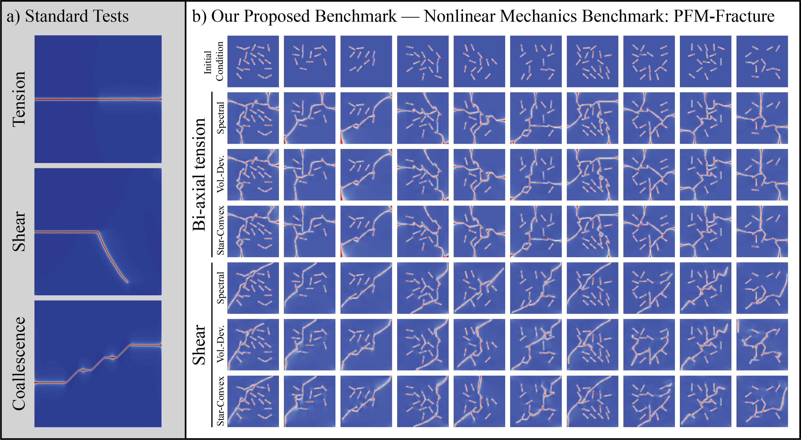
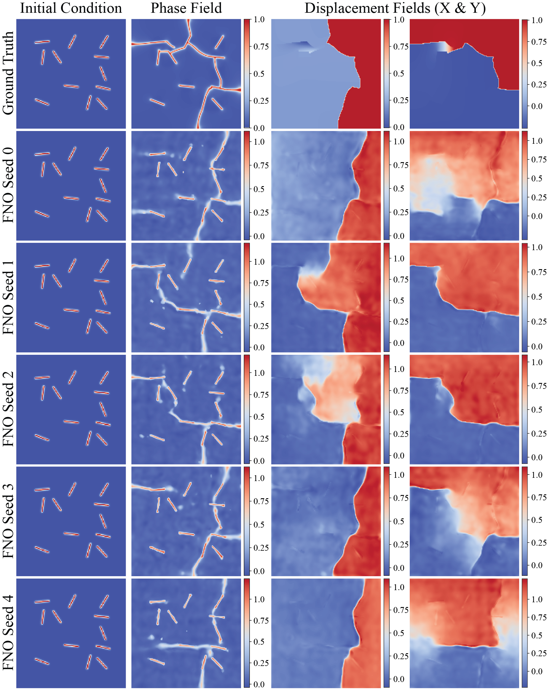

# Towards Robust Surrogate Models: Benchmarking Machine Learning on Phase Field Modeling of Brittle Fracture

Dataset for benchmarking ML surrogate models on phase-field modeling of fracture.
This repository provides script for downloading the datasets, training the baseline models and ensemble learning methods that was discussed in the paper.


## Prerequisites

Install the project in editable mode:

```bash
pip install -e .
```

## Downloading Datasets

You can download the datasets by running the `download_data.py` script and passing the case type and energy decomposition method.

### Arguments

- `--case`: The case type (required)
  - Options: `tension` or `shear`
- `--decomp`: The energy decomposition method (required)
  - Options: `spect`, `vol`, or `star`

### Examples

```bash
# Download tension spectral data
python download_data.py --case tension --decomp spect
```

## Datasets

Download phase-field evolution datasets from Harvard Dataverse:

### Available Datasets

| Case | Decomposition | DOI |
|------|---------------|-----|
| tension | spect | [doi:10.7910/DVN/YLQGUO](https://doi.org/10.7910/DVN/YLQGUO) |
| tension | vol | [doi:10.7910/DVN/G5DLI7](https://doi.org/10.7910/DVN/G5DLI7) |
| tension | star | [doi:10.7910/DVN/9URYI1](https://doi.org/10.7910/DVN/9URYI1) |
| shear | spect | [doi:10.7910/DVN/KZDRUE](https://doi.org/10.7910/DVN/KZDRUE) |
| shear | vol | [doi:10.7910/DVN/OCVQJ1](https://doi.org/10.7910/DVN/OCVQJ1) |
| shear | star | [doi:10.7910/DVN/APUKE5](https://doi.org/10.7910/DVN/APUKE5) |

## Output Structure

The downloaded datasets are stored in the `data` directory with the following structure:
```
data/
├── tension/
|  ├── spect/
|  ├── vol/
|  └── star/
├── shear/
|  ├── spect/
|  ├── vol/
|  └── star/
|      └── 17882.hdf5
|      └── 19030.hdf5
|      └── ...
```
## Using the pretrained models
You can also download the pretrained models and the compressed predictions from [here](https://doi.org/10.7910/DVN/AA86HP) to reproduce the results in the paper.

## Training the baseline models

## UNet
You can find the code for training the UNet model in `src/models/UNet/`:

**Files:**
* `unet.py` – network architecture and loss functions (Dice, Focal, Combined)
* `utils.py` – Dataset handler class
* `train.py` – full training loop with validation and [Weights & Biases](https://wandb.ai/) logging

**Training parameters:**
| Parameter | Default | Description |
|-----------|---------|-------------|
| `--seed` | 0 | Random seed |
| `--res` | 128 | Resolution of the input data|
| `--epochs` | 100 | Number of training epochs |
| `--batch_size` | 16 | Batch size |
| `--learning_rate` | 0.0001 | Initial learning rate |
| `--decay_rate` | 1 | Decay rate for the learning rate |
| `--decay_step` | 50 | Decay step for the learning rate |
| `--in_channels` | 1 | Number of input channels |
| `--alpha` | 0.5 | Weight for Dice loss |
| `--beta` | 0.5 | Weight for Focal loss |
| `--threshold` | 0.4 | Threshold for binarization |
| `--data_dir` | `data/tension/spect` | Path to the dataset |

**Example:**
```bash
python src/models/unet/train.py \
  --data_dir data/tension/spect \
  --epochs 200 \
  --batch_size 8 \
  --learning_rate 5e-5
```

## FNO
You can find the code for training the FNO model in `src/models/FNO/`:
**Files:**
* `fno.py` - Network definition with spectral convolution blocks
* `utils.py` - Dataset handler for sequence data
* `train.py` - Autoregressive training loop with checkpointing

**Training parameters:**
| Parameter | Default | Description |
|-----------|---------|-------------|
| `--initial_step` | 10 | Input timesteps for the network |
| `--training_type` | `autoregressive` | Training type |
| `--t_train` | 101 | Total timesteps to predict |
| `--model_update` | 10 | How often to update the model |
| `--data_dir` | `data/tension/spect` | Path to the dataset |
| `--epochs` | 1001 | Training epochs |
| `--batch_size` | 4 | Batch size |
| `--learning_rate` | 1e-3 | Initial learning rate |
| `--scheduler_step` | 100 | Steps for learning rate scheduler |
| `--scheduler_gamma` | 0.5 | Gamma for learning rate scheduler |
| `--res` | 128 | Resolution of the input data |
| `--seed` | 1 | Random seed |
| `--num_channels` | 1 | Number of channels |
| `--modes` | 12 | Fourier modes per dimension |
| `--width` | 20 | Network channel width |
| `--use_wandb` | True | Enable wandb logging |
| `--wandb_project` | `test-gh` | Wandb project name |
| `--wandb_entity` | None | Wandb entity name |
| `--continue_training` | False | Continue training from checkpoint |

**Example:**
```bash
python src/models/FNO/train.py \
  --data_dir data/tension/spect \
  --epochs 500 \
  --batch_size 4 \
  --learning_rate 1e-3
```
## DRM
You can find the code to reproduce the results in the PINN section of the paper in the `src/DRM` directory, you have to run the `src/DRM/paper_pattern/main.py` code with the network architecture.
```bash
python src/models/DRM/paper_pattern/main.py 6 100 0 TrainableReLU 3.0 volumetric
```
# Evaluating the models
You can evaluate the models by running the `evaluate.py` script for each model. It will save the predictions and dice scores in a dictionary in a pickle file.

**Arguments:**
* You can provide the threshold values for the prediciton and ground truth as the arguments to the `evaluate.py` scripts.

| Parameter | Default | Description |
|-----------|---------|-------------|
| `--model_path` | None | Path to the trained model checkpoint |
| `--data_dir` | None | Path to the dataset directory |
| `--out_dir` | None | Output directory for predictions |
| `--ds_size` | -1 | Dataset size limit (-1 for all) |
| `--threshold_pred` | 0.5 | Threshold for predictions |
| `--threshold_gt` | 0.5 | Threshold for ground truth |

**Example:**
```bash
python src/models/FNO/evaluate.py \
  --model_path src/models/FNO/results/wandb_project/models/FNO_tension_miehe_c64x64_3_300.pt \
  --data_dir data/tension/spect \
  --out_dir src/models/FNO/results/test_gh/preds
  --threshold_pred 0.5 \
  --threshold_gt 0.5
```

**Example:**
```bash
python src/models/UNet/evaluate.py \
  --model_path src/models/UNet/results/wandb_project/models/UNet_tension_spect_3.pkl \
  --data_dir data/tension/spect \
  --out_dir src/models/UNet/results/test_gh/preds
  --threshold_pred 0.5 \
  --threshold_gt 0.5
```
# Ensembling the models
You can ensemble the models by running the `ensembling.py` script.

**Arguments:**
* You can provide the parameters needed for the ensembling methods using the `ensembling_config.yml` file.

| Parameter | Default | Description |
|-----------|---------|-------------|
| `--model` | None | Model type (FNO or UNet) |
| `--config` | None | Path to the ensembling config file |

# Citation
If you use this code or the datasets in your research, please cite:
```
@article{erfan2025towards,
  title={Towards Robust Surrogate Models: Benchmarking Machine Learning on Phase Field Modeling of Brittle Fracture},
  author={Erfan Hamdi and Emma Lejeune},
  journal={arXiv preprint arXiv:2507.01301},
  year={2025}
}
```